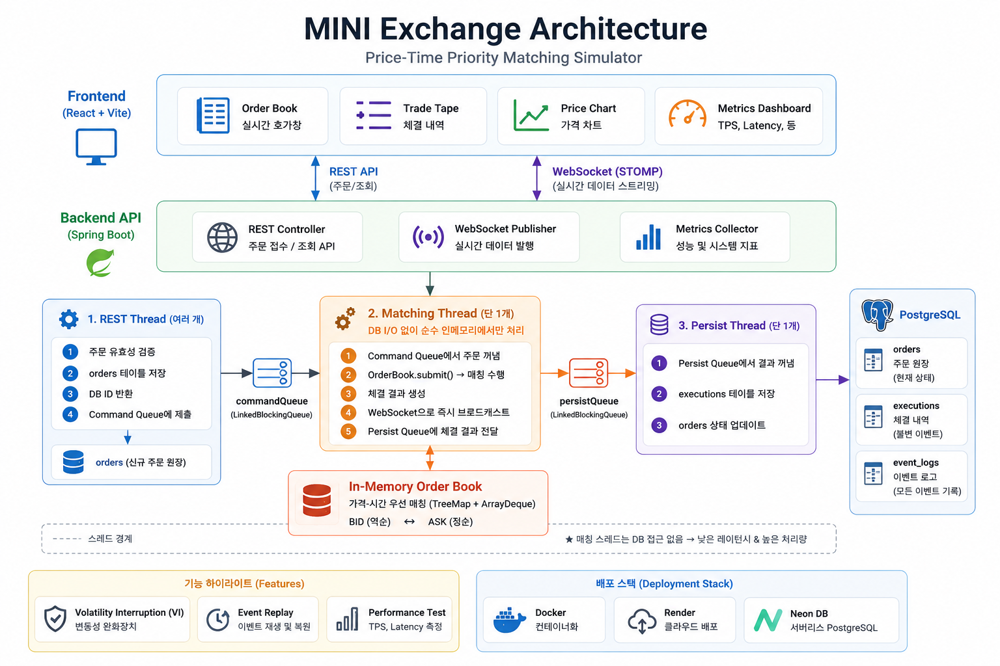

# 미니 거래소 매칭엔진

> 교육·시뮬레이션 목적의 프로젝트입니다. 실거래·실자금을 다루지 않으며, KRX/코스콤 시스템을 그대로 재현한 것이 아닙니다.

한국 자본시장의 가격-시간 우선 매매 체결 원리를 직접 구현한 거래소 시뮬레이터.
인메모리 매칭엔진(단일 스레드, lock-free), 실시간 호가창·체결·차트, 변동성완화장치(VI), 이벤트 소싱 기반 리플레이까지 포함한다.

**🔗 라이브 데모**: https://mini-exchange-web.onrender.com
> Render 무료 플랜이라 첫 접속 시 백엔드가 깨어나는 데 ~30초 걸릴 수 있습니다.

---

## 아키텍처 다이어그램



> React 프론트엔드 ↔ REST/WebSocket(STOMP) ↔ Spring Boot API ↔ 단일 매칭 스레드(인메모리 오더북) → PostgreSQL(orders·executions·event_logs).
> 핵심은 **단일 매칭 스레드**로 lock 없이 race condition을 구조적으로 제거하고, REST 접수·매칭·DB 저장을 세 스레드로 분리한 점이다(자세한 이유는 아래 [설계 결정](#설계-결정)).

---

## 설계 결정

### 1. 오더북 자료구조: `TreeMap<Long, ArrayDeque<Order>>`

**선택 이유**

| 요구사항 | 자료구조 | 복잡도 |
|---|---|---|
| 가격 우선: best bid/ask 즉시 접근 | TreeMap (정렬된 키) | O(log n) |
| 시간 우선: 동일 가격 내 FIFO | ArrayDeque | O(1) enqueue/dequeue |
| 취소: 특정 주문 O(1) 조회 | HashMap orderIndex | O(1) lookup |

- **매수(bid)**: `TreeMap(역순)` → `firstKey()` = 가장 높은 가격 = best bid
- **매도(ask)**: `TreeMap(정순)` → `firstKey()` = 가장 낮은 가격 = best ask
- **가격 표현**: `long` (정수)로 저장하여 부동소수점 오차를 원천 차단

**트레이드오프**

취소 시 `ArrayDeque.remove(order)`는 레벨 내 O(n). 실서비스라면 이중 연결 리스트로 O(1)로 낮출 수 있지만, 단일 종목 시뮬레이터에서 레벨당 주문 수는 소수이므로 실질적 차이 없음.

---

### 2. 동시성 전략: 단일 매칭 스레드 + `LinkedBlockingQueue`

```
외부 스레드 (여럿) ──► LinkedBlockingQueue<OrderCommand>
                                   │
                      [matchingThread (단 1개)] ──► OrderBook (lock-free)
```

**선택 이유**

- `OrderBook`을 단 하나의 스레드만 읽고 쓰므로, **lock 없이 race condition을 구조적으로 제거**
- LMAX Disruptor, 실거래소 매칭엔진이 채택하는 패턴과 같은 원리
- 대안인 `ReentrantLock`이나 `synchronized`보다 단순하고 추론하기 쉬움
- 단일 종목 시뮬레이터 규모에서 단일 스레드 처리량은 충분

**race condition 방지 근거**

외부에서 OrderBook에 직접 접근하는 경로가 없음. REST 스레드는 반드시 커맨드 큐를 통해서만 간접 접근. Java의 `LinkedBlockingQueue`는 생산자-소비자 happens-before를 보장하므로 별도 volatile/synchronized 불필요.

---

### 3. DB 저장 비동기 분리

**흐름**

1. REST 스레드: `orders` 테이블에 저장 (sync) → DB id 확보 → 매칭 큐에 제출
2. 매칭 스레드: 매칭 처리 → WebSocket 즉시 브로드캐스트 → `persistQueue`에 결과 추가
3. Persist 스레드: `executions` 저장 + `orders` 상태 업데이트

**목적**: 매칭 레이턴시에서 DB I/O 제거 → 매칭 처리량과 레이턴시가 DB 성능에 독립

**알려진 트레이드오프**: 서버 비정상 종료 시 체결은 완료됐지만 DB 미저장된 실행 내역이 유실될 수 있음. 시뮬레이터 목적이므로 허용.

---

### 4. 오더북 스냅샷 안전 발행: `volatile` + 불변 record

REST 스레드가 `GET /orderbook`을 호출할 때, 매칭 스레드가 OrderBook을 수정 중일 수 있음.

**해결책**

```java
// MatchingEngine
private volatile OrderBookSnapshot lastSnapshot;

// 매칭 스레드: 매 명령 처리 후 새 불변 스냅샷으로 교체
lastSnapshot = orderBook.snapshot();

// REST 스레드: volatile 읽기 → 항상 완전히 구성된 스냅샷 반환
public OrderBookSnapshot snapshot() { return lastSnapshot; }
```

`OrderBookSnapshot`은 Java record(불변). volatile 쓰기 → volatile 읽기 사이에 happens-before 관계가 성립하여, REST 스레드는 항상 일관된 상태를 봄. 스냅샷은 수 밀리초 지연될 수 있으나 시뮬레이터에서 허용.

---

### 5. DB 스키마 테이블 분리 이유

| 테이블 | 역할 | 분리 이유 |
|---|---|---|
| `orders` | 주문 원장 (현재 상태) | 주문 수명주기(상태 전이)를 추적 |
| `executions` | 체결 내역 (불변 이벤트) | 주문 상태와 독립적으로 체결 감사 가능 |
| `event_logs` | 모든 이벤트 로그 (Phase 2) | 사후 재현·리플레이를 위한 이벤트 소싱 기반 |

orders와 executions를 합치면 단순해지지만, "이 주문이 몇 번에 나눠 체결됐나"를 추적하려면 별도 테이블이 필수. Phase 2의 이벤트 리플레이도 executions가 분리되어야 가능.

### 6. 시뮬레이터: 단일 랜덤워크 → 다중 트레이더 전략 (Phase 3)

초기 시뮬레이터는 기준가를 가우시안 랜덤워크로 움직이는 단일 로직이라 가격이 무방향으로 진동만 했다. Phase 3에서 **무상태 전략 객체(`Trader`) 조합**으로 재구조화했다.

| 트레이더 | 행동 | 시장에 미치는 효과 |
|---|---|---|
| `NoiseTrader` | 기준가 ±틱에 양면 limit | 유동성·호가 depth 공급 |
| `MomentumTrader` | 최근 추세 방향으로 시장가 추격 | 추세 증폭 → 급변동 유발 |
| `MeanReversionTrader` | 이동평균 대비 ±band 벗어나면 반대 베팅 | 가격을 평균으로 되돌림 |
| `LargeTrader` | 낮은 확률로 여러 레벨 휩쓰는 대형 시장가 | 순간 가격 점프(고래) |

**설계 결정**:
- 트레이더는 `MatchingEngine`을 직접 보지 않고 **읽기 전용 `MarketView`(불변 record)만** 받는다 → 전략 로직을 순수 함수처럼 시드 고정 RNG로 단위 테스트(`TraderStrategyTest`).
- 주문 출구를 `OrderGateway` 인터페이스로 분리 → 테스트에서 호출을 캡처하는 가짜 구현 주입.
- 엔진은 `lastTradePrice`(volatile)만 노출하고, 시뮬레이터가 이를 읽어 기준가를 실제 체결가로 수렴시킴 → 모멘텀/평균회귀가 **자기 체결 결과에 반응**하는 피드백 루프 형성.
- 각 주문의 `clientOrderId`에 트레이더 태그(`MOMENTUM-…` 등)를 붙여 스키마 변경 없이 이벤트 로그에서 출처를 식별.

모멘텀+대형 트레이더가 만드는 급변동은 다음 단계(VI 변동성완화장치)의 트리거 재료가 된다.

추가로, 시뮬레이터는 오더북이 상한(60건)을 넘으면 가장 오래된 안착 주문을 취소한다. 실시장처럼 주문이 영원히 남지 않게 해 **메모리·DB 무한 증가를 막고**, 동시에 대형 주문이 가격을 실제로 움직일 수 있도록(VI 발동 가능) 깊이를 제한한다.

### 7. 변동성완화장치(VI): 정지 후 일괄 체결 (Phase 3)

기준가에서 ±2.5% 벗어나는 체결가가 프린트되면 매칭을 5초간 정지하는 한국식 **정적 VI**를 구현했다.

```
정상 매칭 → 체결가가 밴드(±2.5%) 이탈 → [정지] 5초간 주문은 오더북에 쌓이기만 함
         → cooldown 경과 → [해제] 쌓인 교차 주문을 한 번에 일괄 체결(uncross)
```

**설계 결정**:
- VI 상태(`VolatilityGuard`)를 **매칭 스레드 안에서만** 다룬다 → 정지/해제·일괄체결이 모두 단일 스레드 내 동작이라 **lock이 전혀 필요 없다**(동시성 전략 #2의 자연스러운 연장).
- 기준가는 매 체결이 아니라 **8초 간격의 느린 앵커**로 갱신한다. 매 체결마다 갱신하면 기준가가 가격을 바짝 따라가 급변동을 절대 못 잡는다. 앵커가 약간 stale하기 때문에 짧은 시간의 급격한 이동을 감지할 수 있다.
- 트리거는 **첫 체결가가 아니라 가장 깊은 체결가**(주문이 호가를 쓸고 도달한 최종가)로 판정한다. 첫 체결가는 최우선호가라 항상 기준가 근처여서, 대형 주문이 여러 레벨을 휩쓸어도 트리거되지 않는 함정을 피한다.
- 해제 시 `OrderBook.uncross()`로 교차분을 일괄 체결 — 기존 `matchLimit` 로직을 재사용(쌓인 best bid를 공격자로 꺼내 반대편과 체결)하므로 매칭 규칙이 정상 경로와 100% 동일하다.
- 정지/해제는 `/topic/vi`(WebSocket)로 즉시 브로드캐스트(프론트 배너) + `event_logs`에 `VI_TRIGGERED`/`VI_RELEASED`로 기록.
- `now`(epoch ms)를 인자로 주입해 시계 의존성을 없앰 → `VolatilityGuardTest`에서 결정적으로 검증.

**단순화한 한계**(정직한 기록): 실제 KRX VI는 정지 후 단일가매매로 하나의 균형가에 체결되지만, 본 구현의 uncross는 쌓인 주문을 순차 체결해 복수의 체결가가 나올 수 있다. 정지 중 시장가 주문은 가격이 없어 안착할 수 없으므로 거부한다.

### 8. 이벤트 리플레이: 사후 복원과 결정성 (Phase 3)

`event_logs`의 주문 입력(`ORDER_SUBMITTED`/`ORDER_CANCELLED`)만 발생 순서대로 꺼내 **완전히 새로운 `OrderBook`**에 가격-시간 우선으로 다시 매칭하고, 원본 `EXECUTION` 기록과 대조한다(`GET /replay`).

**설계 결정**:
- 단일 매칭 스레드 + 결정적 매칭이므로 "같은 입력을 같은 순서로 넣으면 같은 체결이 나온다". 통합 테스트(`ReplayIntegrationTest`)는 VI가 발동하지 않는 입력에서 **재구성 체결이 원본과 정확히 일치**함을 검증한다(이벤트 소싱의 사후 복원 가능성 증명).
- 라이브 상태를 건드리지 않는 **읽기 전용** 재구성(별도 OrderBook 인스턴스). 기존 `OrderBook`/매칭 로직을 그대로 재사용.
- `event_logs`를 3테이블로 분리(설계결정 #5)해 둔 덕분에 주문 원장/체결 내역과 독립적으로 "발생한 모든 사건"을 시간순으로 보관 → 리플레이가 가능.
- **메모리 보호(상시 배포)**: 시뮬레이터가 24시간 이벤트를 적재해 `event_logs`는 무한히 증가한다. 전체를 메모리에 올리는 리플레이는 OOM을 유발하므로 ① 리플레이는 **최근 윈도우(최대 5,000건)**만 로드하고, ② `EventLogRetention`이 주기적으로 **최근 5만 건만 남기고** 오래된 이벤트를 삭제한다. 윈도우 밖에서 제출된 주문은 재구성 책에 없으므로, **양쪽 주문이 모두 윈도우 안에서 제출된 체결만** 원본 비교 대상으로 삼아 경계 효과를 제거한다.

**VI와의 상호작용(흥미로운 관찰)**: 순수 가격-시간 우선 재구성은 VI를 적용하지 않으므로, 라이브에서 VI가 매칭을 지연·억제한 구간이 있으면 재구성 체결 수가 원본과 달라진다. 즉 리플레이는 "VI가 없었다면 어땠을까"의 **반사실(counterfactual)**을 보여주며, 원본과의 차이가 곧 VI의 시장 개입 효과다. 화면에서 일치(✓) 또는 차이(△ + 차이 건수)로 표시한다.

---

## 기술 스택

- **Backend**: Java 17, Spring Boot 3.5, Spring WebSocket (STOMP), JPA, PostgreSQL
- **Frontend**: React, TypeScript, Vite, Recharts — 호가창·체결 테이프·가격 차트·메트릭 패널·VI 배너·리플레이 패널
- **Infra**: Docker(멀티스테이지), Render(백엔드 Web Service + 프론트 Static Site), Neon(PostgreSQL)

---

## 실행 방법

### 1. Docker Compose (권장)

PostgreSQL + 백엔드를 한 번에 실행합니다.

```bash
# 백엔드 빌드 후 컨테이너 실행
cd backend
./gradlew bootJar
cd ..
docker-compose up --build
```

프론트엔드는 별도로 실행합니다.

```bash
cd frontend
npm install
npm run dev
# http://localhost:5173 에서 확인
```

### 2. 로컬 개발 (H2 인메모리)

PostgreSQL 없이 H2로 바로 실행합니다.

```bash
# 백엔드 (포트 8080, H2 자동 스키마 생성)
cd backend
./gradlew bootRun

# 프론트엔드 (포트 5173, 백엔드로 프록시)
cd frontend
npm install
npm run dev
```

### 3. 테스트

```bash
cd backend
./gradlew test
```

> **Note:** 시뮬레이터가 자동으로 4종 트레이더(노이즈·모멘텀·평균회귀·대형)의 주문을 500ms 간격으로 생성합니다.  
> 시뮬레이터를 끄려면 `application.yml`에서 `simulator.enabled: false`로 설정하세요.

### 4. 배포 (Render + Neon)

Render(백엔드 Docker + 프론트 정적) + Neon(영구 무료 PostgreSQL) 배포 방법과 필요한 환경변수는 **[DEPLOY.md](DEPLOY.md)** 참고.

---

## 성능 테스트 결과

> 환경: Windows 11, JDK 17, `LinkedBlockingQueue` 기반 단일 매칭 스레드  
> 측정 코드: `MatchingEnginePerformanceTest` (재현 가능, `./gradlew test --tests "*MatchingEnginePerformanceTest"`)  
> 워크로드: BUY/SELL 교대 limit 주문 (가격 교차 발생 → 약 절반이 즉시 체결)

### (A) 매칭 레이턴시 — `OrderBook.submit()` 자체 처리 시간

매칭 알고리즘(가격 교차 탐색 + 체결 + 잔량 등록)에 드는 시간을 주문별로 측정.

| 주문 수 | 평균 | p99 | p99.9 | 최대 | 순수 처리량 |
|---|---|---|---|---|---|
| **10,000** | 0.95 µs | 7.3 µs | 39.5 µs | 100.4 µs | 1,052,237 orders/s |
| **100,000** | 0.36 µs | 1.0 µs | 6.8 µs | 1,826.5 µs | 2,781,465 orders/s |
| **500,000** | 0.19 µs | 0.6 µs | 3.9 µs | 1,288.9 µs | 5,298,918 orders/s |

- 평균/​p99 매칭 레이턴시는 **1µs 미만~수 µs** 수준
- **최대값(100µs~1.8ms)은 매칭 비용이 아니라 JVM GC/JIT 일시정지** 때문 (p99.9까지는 한 자릿수 µs인데 max만 튐)
- 배치가 클수록 평균이 낮아지는 건 JIT 최적화·캐시 워밍업 효과

### (B) 실측 TPS + 비동기 저장 큐(PersistQueue) 백프레셔

실제 `MatchingEngine`(단일 스레드) + `MatchingEngineConfig`와 동일한 `ThreadPoolExecutor`(core 1, queue 10,000)로,
**하드코딩 대기 없이** 매칭 스레드가 전체 명령을 소진한 시점까지의 시간으로 TPS를 계산.

| 주문 수 | 체결 건수 | 매칭 완료 시간 | 실측 TPS | persist 큐 최대 적체 | reject | 큐 소진 |
|---|---|---|---|---|---|---|
| **10,000** | 5,800 | 0.099 s | 100,862 /s | 78 / 10,000 | 0 | ✅ 전량 |
| **100,000** | 50,800 | 0.308 s | 324,832 /s | 36 / 10,000 | 0 | ✅ 전량 |
| **500,000** | 250,800 | 1.322 s | **378,296 /s** | **153 / 10,000** | **0** | ✅ 전량 |

- **PersistQueue 안 밀림**: 50만 건에서도 큐 최대 적체 153건(용량 10,000의 1.5%), 거부 0건, 250,800개 저장 작업 전량 완료
- **메모리 비정상 증가 없음**: 모든 규모에서 힙 증가 ≈ 0 KB. 교차 주문이 즉시 체결돼 잔류 미체결 주문이 0이므로 오더북이 커지지 않음
- **재현성 주의(정직한 기록)**: TPS는 머신 부하·JIT 워밍업에 민감해 실행마다 변동된다. 위 표는 한 번의 대표 실행값이고, 다시 돌리면 500K 기준 대략 **24만~38만/s 범위**에서 출렁였다. 반면 매칭 레이턴시(p99 sub-µs)는 실행을 반복해도 안정적으로 재현됐다. 절대 수치보다 "단일 스레드로 초당 수십만 건을 처리하고 저장 큐는 거의 비어 있다"는 경향이 핵심.
- **주의(정직한 한계)**: (B)의 persist 작업은 객체 구성 비용만 모사하고 **실제 PostgreSQL I/O는 포함하지 않음**. 실 DB(ms 단위 쓰기)에서 동일한 50만 건 버스트가 들어오면 큐(10,000, AbortPolicy)가 가득 차 거부가 발생할 수 있음 → 이는 의도된 백프레셔 한계. 실제 운영에서는 체결이 시뮬레이터 속도(초당 수 건)로 발생하므로 큐는 항상 비어 있음

---

## API 명세

| Method | Path | 설명 |
|---|---|---|
| `POST` | `/orders` | 주문 제출 |
| `DELETE` | `/orders/{id}` | 주문 취소 |
| `GET` | `/orderbook` | 오더북 스냅샷 |
| `GET` | `/trades` | 최근 체결 내역 (최대 50건) |
| `GET` | `/metrics` | 매칭 레이턴시·TPS·미체결 주문 수 |
| `GET` | `/events` | 이벤트 로그 조회 (최대 100건, 최신순) |
| `GET` | `/replay` | 이벤트 리플레이 — 입력 재생으로 체결 재구성·대조 |
| `WS` | `/topic/orderbook` | 오더북 실시간 업데이트 |
| `WS` | `/topic/trades` | 체결 이벤트 실시간 스트림 |
| `WS` | `/topic/vi` | 변동성완화장치(VI) 정지/해제 상태 |

---

## 회고

### 왜 이 프로젝트를 만들었나
주식 주문이 어떻게 체결되는지 글로만 알고 있었는데, 막상 직접 만들어 보니 고민할 게 생각보다 많았다. 가격-시간 우선, 부분 체결, 시장가/지정가, 동시 주문, 거래정지까지 하나씩 구현하면서 매매 시스템이 왜 그렇게 설계되는지 조금은 이해하게 됐다. 기능을 많이 넣기보다 각 결정에 이유를 댈 수 있는 프로젝트로 만들고 싶었다.

### 동시성을 어떻게 처리할까
제일 오래 붙잡고 있던 부분이다. 주문이 동시에 들어올 때 오더북을 어떻게 보호하느냐인데, 처음엔 lock을 생각했다. 그런데 lock을 쓰면 결국 경합이나 데드락을 신경 써야 하고 디버깅도 까다로워진다. 그래서 방향을 바꿔, 주문을 전부 큐에 넣고 스레드 하나가 순서대로 처리하게 했다. 외부 스레드는 큐에 넣고 바로 빠지고, 매칭은 한 스레드만 한다.

이렇게 하니 lock이 없어서 race condition을 걱정할 일이 없었다. 부수적으로 매칭 순서가 항상 같아서 나중에 이벤트 리플레이로 똑같은 체결을 재현할 수 있었고, VI(거래정지)를 붙일 때도 정지 상태를 그냥 필드 하나로 다룰 수 있었다. 기반을 잘 잡아두면 뒤에 기능 붙이기가 쉬워진다는 걸 느꼈다. 물론 단일 스레드라 수평 확장은 어렵지만, 단일 종목 시뮬레이터에서는 처리량이 충분하다는 걸 성능 테스트로 확인했다.

### 성능 테스트를 다시 쓴 일
처음 만든 성능 테스트는 사실 매칭 시간이 아니라 큐에 넣는 시간을 재고 있었고, 중간에 sleep까지 들어가서 TPS도 틀린 값이었다. "1µs"라는 숫자는 보기 좋았지만 애초에 잘못 재고 있었던 거였다. 이걸 알고 나서 매칭 자체 시간(A)과 엔진+저장 큐 처리량(B)을 나눠서 다시 측정했다. 숫자는 덜 화려해졌지만 적어도 맞는 걸 재게 됐고, persist 단계가 실제 DB I/O를 포함하지 않는다는 한계도 그대로 적어뒀다. 포트폴리오라고 숫자를 부풀리고 싶진 않았다.

### VI 트리거 버그
VI를 "첫 체결가가 기준가에서 일정 % 벗어나면 발동"으로 만들었는데, 대형 주문이 호가를 쓸어내려도 발동이 안 됐다. 알고 보니 주문이 여러 호가를 휩쓸어도 첫 체결가는 늘 최우선호가라 기준가랑 거의 같았던 게 원인이었다. 판정 기준을 마지막(가장 깊은) 체결가로 바꾸니 의도대로 됐다. 매칭이 실제로 어떻게 일어나는지 알아야 조건을 제대로 잡을 수 있다는 걸 알게 됐다.

### 시뮬레이터가 잘 안 움직이던 문제
VI가 발동하려면 가격이 출렁여야 하는데, 단일 랜덤워크로는 가격이 거의 안 움직였다. 원인을 보니 오더북에 주문이 쌓이기만 해서(미체결 수가 끝없이 증가) 대형 주문이 들어와도 가격이 안 밀리는 상태였다. 이건 메모리랑 DB가 계속 커지는 문제이기도 했다. 시뮬레이터가 오래된 주문을 자동으로 취소하게 해서 오더북을 얇게 유지했더니 메모리 문제랑 VI가 안 터지던 문제가 같이 해결됐다. 여기에 모멘텀·평균회귀·대형 트레이더를 추가해 추세와 급변동이 자연스럽게 나오게 했다.

그런데 배포 후 다시 보니 가격이 여전히 밋밋했다. 기준가 랜덤워크 한 걸음의 크기(±0.05%≈25원)가 1틱(100원)보다 작은데, 그 드리프트를 틱 단위로 내림(`roundToTick`)하고 있어서 **거의 매 tick 드리프트가 0으로 사라지고 있었다.** 게다가 기준가를 매번 체결가 쪽으로 절반(0.5) 끌어당겨 추세가 곧바로 평탄화됐다. 드리프트를 틱으로 내리지 말고 그대로 누적하고(틱 정렬은 트레이더가 주문 낼 때만), 체결가 수렴 가중치를 0.25로 낮추니 추세가 살아나면서 모멘텀 트레이더까지 깨어났다. "반올림 한 줄이 시뮬레이션 전체를 죽일 수 있다"는 걸 배웠다.

### 리플레이 버튼이 서버를 죽인 일
배포된 서버가 메모리 한도 초과로 재시작된다는 알림을 받았다. 추적해 보니 리플레이가 `event_logs` **전체를 한 번에 메모리로 로드**하고 있었는데, 시뮬레이터가 24시간 이벤트를 적재하니 이 테이블이 무한히 커진 게 화근이었다. "데모 규모라 전체 로드"라고 가정했던 게 상시 배포에서 깨진 것이다. 버튼을 연타하면 거대한 테이블을 동시에 여러 벌 힙에 올려 OOM이 났다. 리플레이를 최근 윈도우(5,000건)로 제한하고, 오래된 이벤트를 주기적으로 정리(최근 5만 건 유지)하는 보존정책을 넣어 해결했다. 무한히 자라는 로그를 다루는 시스템은 **반드시 상한(bounded)을 설계해야 한다**는 걸 체감했다.

### 한계
- 성능 테스트의 persist 단계는 객체 구성 비용만 모사하고 실제 PostgreSQL I/O는 포함하지 않는다.
- VI는 KRX의 단일가매매를 순차 일괄체결로 단순화했고, 리플레이는 순수 가격-시간 우선이라 VI 구간에서 원본과 차이가 난다(그 차이를 VI의 효과로 해석해 보여준다).
- 단일 종목·단일 인스턴스. 다중 인스턴스 확장(Redis 등)은 범위 밖에 뒀다.

### 더 했다면
- 실제 DB I/O를 포함한 부하 테스트
- 리플레이를 VI 이벤트까지 포함해 완전히 재현하고, 체결 과정을 단계별로 시각화
- 주문 정정/취소까지 포함한 현실적인 트레이더, 다종목 확장

규모는 작지만 설계를 하나하나 직접 정하고 그 이유를 적어본 게 가장 남는 경험이었다.
